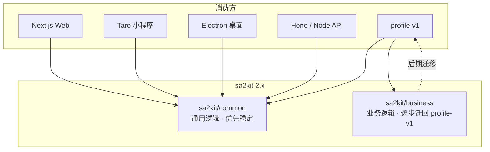

# SA2Kit 2.0 重构 Backlog

> **单一事实来源（SSOT）**：本文件追踪 sa2kit 从 1.x「工具库 + 业务单体」到 2.x「common / business 分层」的全部重构任务。  
> **版本线**：自 `2.0.0-alpha.0` 起进入 2.0 重构；稳定版目标为 `2.0.0`。  
> **最后更新**：2026-06-09（alpha.8）

---

## 1. 重构目标

### 1.1 为什么要做 2.0

当前 sa2kit 同时承担：

- 跨项目可复用的 **基础设施**（logger、文件、auth、request…）
- profile-v1 的 **业务交付物**（showmasterpiece、mikuContest、huarongdao…）

导致：构建体积大（dist ~52MB）、exports 爆炸（~538 条）、client/server 边界模糊、业务迁出后仍双份维护。

### 1.2 目标架构



### 1.3 分层定义

| 层级 | 路径（目标） | npm 导出入口（目标） | 职责 | 依赖规则 |
|------|-------------|---------------------|------|----------|
| **common** | `packages/common/` 或 `src/common/` | `sa2kit/common`、`sa2kit/common/*` | 与具体业务无关；可在 Web / Taro / Electron / Hono 复用 | **禁止** import business；platform 适配通过 adapter |
| **business** | `packages/business/` 或 `src/business/` | `sa2kit/business/*` | 具体产品域（画集、赛事、小游戏…） | 可依赖 common；**不应**被 common 反向依赖 |

### 1.4 common 模块归属（目标清单）

| 模块 | 归入 common | 说明 |
|------|:-----------:|------|
| logger | ✅ | 纯工具 |
| utils | ✅ | 纯工具 |
| storage (+ adapters) | ✅ | 平台存储抽象 |
| request | ✅ | HTTP 客户端 |
| i18n | ✅ | 国际化内核 |
| analytics（内核） | ✅ | 事件模型 + adapter |
| config（内核） | ✅ | 配置读取抽象 |
| auth（新一代 API） | ✅ | schema / services / middleware |
| universalFile（内核） | ✅ | 服务端文件平台 |
| ossFile | ✅ | 对外推荐文件 SSOT |
| universalExport（内核） | ✅ | 导出引擎 |
| api（基础 client） | ✅ | 与业务无关的 API 工具 |
| components（基础 UI primitives） | ⚠️ 待定 | 仅保留无业务语义的 primitives |
| imageCrop | ✅ | 工具型 |

### 1.5 business 模块归属（目标清单）

| 模块 | 归入 business | 迁回 profile-v1 优先级 |
|------|:-------------:|------------------------|
| showmasterpiece | ✅ | **P0**（已在 profile-v1 本地化，sa2kit 内待删除） |
| mikuContest | ✅ | P1 |
| huarongdao / bubbleShooter / mikuFlick | ✅ | P1（实验田游戏） |
| mmd / mikuFireworks3D / mikuFusionGame | ✅ | P2 |
| calendar / festivalCard / vocaloidBooth | ✅ | P2 |
| testField / portfolio / profile 页面 | ✅ | P2 |
| qqbot / screenReceiver / iflytek | ✅ | P3 |
| testYourself / music / ar | ✅ | P3 |

---

## 2. 版本策略

| 阶段 | 版本号 | 含义 |
|------|--------|------|
| 重构启动 | `2.0.0-alpha.0` | 架构/doc/目录调整开始；**不保证 API 稳定** |
| 各 Phase 完成 | `2.0.0-alpha.N` | 按 Phase 递增 alpha |
| common API 冻结 | `2.0.0-beta.0` | common exports 稳定，business 仍可变 |
| 正式版 | `2.0.0` | common 稳定；business 标记 deprecated 或拆包 |
| 1.x | `1.6.x` | **维护模式**：仅 critical fix，不再新增业务 |

**Breaking change 原则（2.0）**

- `sa2kit/common/*`：严格 semver，breaking 必须 major
- `sa2kit/business/*`：允许在 alpha 内 breaking；迁回 profile-v1 后直接删除 export

---

## 3. 任务状态图例

| 标记 | 含义 |
|------|------|
| ⬜ | 未开始 |
| 🔄 | 进行中 |
| ✅ | 已完成 |
| ⏸ | 阻塞 |
| ❌ | 取消 |

**工时估算说明**：1 人日 ≈ 6h 有效开发；含自测，不含大规模 QA。

---

## 4. Phase 0 — 启动与基线（推荐顺序：第 1 周）

> 目标：确立 2.0 版本线、文档 SSOT、可追踪进度、最小 smoke 防护。

| ID | 任务 | 优先级 | 工时 | 影响面 | 依赖 | 状态 |
|----|------|--------|------|--------|------|------|
| R2-001 | 将 `package.json` version 设为 `2.0.0-alpha.0`；README 增加 2.0 重构说明链接 | P0 | 0.5d | `package.json`、`README.md` | — | ✅ |
| R2-002 | 本文件作为 SSOT；每完成子任务更新状态与日期 | P0 | 0.5d | `docs/REFACTOR_2.0_BACKLOG.md` | R2-001 | ✅ |
| R2-003 | 新增 `CHANGELOG.md` 2.0 章节，记录 alpha 变更 | P1 | 0.5d | `CHANGELOG.md` | R2-001 | ✅ |
| R2-004 | 建立 `scripts/smoke-exports.mjs`：遍历 common 目标 exports 做 import 冒烟 | P0 | 1d | `scripts/`、CI | R2-001 | ✅ |
| R2-005 | 统计并归档当前 exports 清单到 `docs/exports-1.x-snapshot.json` | P1 | 0.5d | 文档 | — | ✅ |
| R2-006 | profile-v1 侧建立对应追踪：`docs/sa2kit-2.0-migration.md`（消费方迁移清单） | P1 | 0.5d | profile-v1 | R2-002 | ✅ |

**Phase 0 验收标准**

- [x] 版本号为 `2.0.0-alpha.1`
- [x] smoke-exports 可在 CI 跑通（允许 business exports 暂时 skip）
- [x] 本 backlog 中 Phase 0 任务全部 ✅

---

## 5. Phase 1 — 目录与边界重整（第 2–3 周）

> 目标：物理目录与依赖方向对齐 common / business，尚未要求 build 完全优化。

| ID | 任务 | 优先级 | 工时 | 影响面 | 依赖 | 状态 |
|----|------|--------|------|--------|------|------|
| R2-101 | 引入 `src/common/`、`src/business/` 顶层目录（或 `packages/common` + `packages/business` monorepo） | P0 | 1d | 全仓库路径 | R2-002 | ✅ |
| R2-102 | 将 `logger`、`utils`、`storage`、`request` 迁入 `common/` | P0 | 1d | ~4 模块、tsup entry | R2-101 | ✅ |
| R2-103 | 将 `universalFile`、`ossFile`、`universalExport` 迁入 `common/file`、`common/export` | P0 | 2d | 文件链路、profile-v1 | R2-101 | ✅ |
| R2-104 | 将 `auth`（非 legacy UI）内核迁入 `common/auth` | P1 | 2d | auth exports | R2-101 | ✅ |
| R2-105 | 将 `src/business/*` 现有业务统一归入 `src/business/`（含 showmasterpiece） | P0 | 1d | business 全部 | R2-101 | ✅ |
| R2-106 | 添加 ESLint `no-restricted-imports`：**common 禁止 import business** | P0 | 0.5d | `.eslintrc` | R2-101 | ✅ |
| R2-107 | 添加 ESLint：**business 禁止 import 其他 business 子域**（除显式 whitelist） | P1 | 0.5d | `.eslintrc` | R2-105 | ✅ |
| R2-108 | 更新 `tsconfig paths`：`@common/*`、`@business/*` | P1 | 0.5d | `tsconfig.json` | R2-101 | ✅ |
| R2-109 | 更新 `package.json` exports 新增 `./common`、`./business` 前缀（旧路径保留 deprecated alias） | P0 | 1d | exports | R2-102~105 | ✅ |

**Phase 1 验收标准**

- [x] 目录树符合 §1.3 分层（re-export 阶段；物理搬迁后续 Phase 3）
- [x] ESLint 边界规则 CI 生效
- [x] `sa2kit/common/logger` 等新路径可 import（旧路径仍可用）

---

## 6. Phase 2 — common 硬化（第 3–6 周）

> 目标：common 成为多 Node 项目可接入的稳定内核；消除 globalThis、双实现、client/server 混包。

### 6.1 文件子系统（ossFile SSOT）

| ID | 任务 | 优先级 | 工时 | 影响面 | 依赖 | 状态 |
|----|------|--------|------|--------|------|------|
| R2-201 | 完成 `ossFile` 构建与 dts 稳定；`ossFile/server` 无 duplicate export | P0 | 1d | sa2kit build | R2-103 | ✅ |
| R2-202 | 删除 `src/services/universalFile/` 桩实现 | P0 | 0.5d | showmasterpiece、UniversalFileService | R2-201 | ✅ |
| R2-203 | 移除 `__sa2kitShowmasterpieceResolveFileUrl` globalThis 契约；改为显式 `createFileUrlResolver(deps)` | P0 | 1.5d | universalFile、showmasterpiece DB | R2-202 | ✅ |
| R2-204 | 统一 upload 字段：`folderPath` / `customPath` 在 client + API 双端兼容 | P0 | 0.5d | ossFile client、profile-v1 upload route | R2-201 | ✅ |
| R2-205 | common 导出 `createOssFileBootstrap({ loadEnv })` 一站式服务端初始化 | P1 | 1d | profile-v1 各 API route | R2-201 | ✅ |
| R2-206 | 将 Drizzle schema 拆为 `common/file/schema`（可选独立 `@sa2kit/file-schema`） | P1 | 2d | db migration | R2-103 | ✅ |
| R2-207 | 补 `ossFile` + `universalFile/server` 集成测试（upload → getUrl） | P0 | 2d | `tests/` | R2-201 | ✅ |

### 6.2 client / server 边界

| ID | 任务 | 优先级 | 工时 | 影响面 | 依赖 | 状态 |
|----|------|--------|------|--------|------|------|
| R2-211 | 为 common 各模块明确 `index.ts`（browser）与 `server/index.ts`（node） | P0 | 2d | 全部 common 模块 | R2-102 | ✅ |
| R2-212 | `package.json` exports 增加 `"browser"` / `"node"` 条件（或 `"import"` 分流） | P0 | 1.5d | exports、webpack | R2-211 | ✅ |
| R2-213 | 禁止 common browser entry 静态 import `postgres` / `ali-oss` / `node:crypto` | P0 | 1d | lint + 单测 | R2-211 | ✅ |

### 6.3 跨平台 adapter（Web / Taro / Electron / Hono）

| ID | 任务 | 优先级 | 工时 | 影响面 | 依赖 | 状态 |
|----|------|--------|------|--------|------|------|
| R2-221 | 定义 `PlatformAdapter` 接口（storage、fetch、file pick） | P1 | 1d | `common/platform` | R2-102 | ✅ |
| R2-222 | 提供 `web` / `taro` / `electron` / `node-hono` 四个官方 adapter 骨架 | P1 | 3d | adapters | R2-221 | ✅ |
| R2-223 | `ossFile` client 通过 adapter 注入 fetch（便于 Hono SSR / Taro） | P1 | 1d | ossFile | R2-221 | ✅ |
| R2-224 | 文档：`docs/common-platform-adapters.md` | P2 | 0.5d | docs | R2-222 | ✅ |

### 6.4 其他 common 清理

| ID | 任务 | 优先级 | 工时 | 影响面 | 依赖 | 状态 |
|----|------|--------|------|--------|------|------|
| R2-231 | 统一包名文档为 `sa2kit`（或正式 rename `@sa2kit/common`） | P1 | 0.5d | README、constants | R2-001 | ✅ |
| R2-232 | 移除 library 内生产 `console.log`；改用 logger + 可关闭 debug | P2 | 1d | universalFile client 等 | R2-102 | ✅ |
| R2-233 | 修正 README「零依赖」表述；拆分 optional peer 文档 | P1 | 0.5d | README | — | ✅ |
| R2-234 | 删除 analytics / screenReceiver 等 globalThis 单例，改为 registry | P1 | 1.5d | analytics、screenReceiver | R2-221 | ✅ |

**Phase 2 验收标准**

- [x] profile-v1 仅通过 `sa2kit/common/file`（ossFile）接入上传下载（R2-501~504）
- [x] 无 globalThis 文件 URL 契约
- [x] browser bundle 不含 postgres / ali-oss 静态引用
- [x] ossFile 集成测试 CI 通过

---

## 7. Phase 3 — 构建与分包（第 5–7 周）

> 目标：dist 从 ~52MB 降下来；entry 从 126 个收敛；install/build 不再 require 16GB heap。

| ID | 任务 | 优先级 | 工时 | 影响面 | 依赖 | 状态 |
|----|------|--------|------|--------|------|------|
| R2-301 | tsup 拆为 `tsup.common.config.ts` + `tsup.business.config.ts` | P0 | 1d | 构建 | R2-101 | ✅ |
| R2-302 | common 启用 `splitting: true` + 共享 chunk | P0 | 2d | dist 体积 | R2-301 | ✅ |
| R2-303 | business 按需 entry：仅保留仍被 profile-v1 引用的 subpath | P0 | 1.5d | exports | R2-301 | ✅ |
| R2-304 | exports 从 ~538 收敛到 common ~40 + business ~N（N 逐步减小） | P0 | 1d | package.json | R2-303 | ✅ |
| R2-305 | `prepare` 脚本改为仅 build common（business 可选 `--with-business`） | P1 | 0.5d | 安装体验 | R2-301 | ✅ |
| R2-306 | CI：common build < 4GB heap；dist common < 10MB（首版目标） | P1 | 1d | CI | R2-302 | ✅ |
| R2-307 | 生成 `exports` 自动生成脚本，避免手写 500+ 条 | P1 | 1d |  tooling | R2-304 | ✅ |

**Phase 3 验收标准**

- [x] `pnpm build:common` 在 4GB 内完成
- [x] common dist 体积较 1.x 全量下降 ≥ 80%（common 子树 ≈ 1.8MB）
- [x] exports 清单有自动生成与 CI 校验

---

## 8. Phase 4 — business 隔离与 deprecate（第 6–10 周）

> 目标：business 与 common 解耦发布；已迁回 profile-v1 的业务从 sa2kit 删除。

| ID | 任务 | 优先级 | 工时 | 影响面 | 依赖 | 状态 |
|----|------|--------|------|--------|------|------|
| R2-401 | **删除** sa2kit 内 `business/showmasterpiece` 全部源码与 exports | P0 | 1d | sa2kit、profile-v1 引用扫描 | R2-105、profile-v1 迁移完成 | ✅ |
| R2-402 | 删除 showmasterpiece 相关 tsup entry（~10 个） | P0 | 0.5d | tsup、dist | R2-401 | ✅ |
| R2-403 | business 包标记 `deprecated` 的 exports 列表写入 `docs/business-deprecated-exports.md` | P1 | 0.5d | docs | R2-304 | ✅ |
| R2-404 | 拆分 business UI：禁止 business 页面 import `@/components` 整包；改为 peer UI 或 props 注入 | P1 | 3d | showmasterpiece 等 UI | R2-105 | ✅ |
| R2-405 | auth/legacy 移入 business 或 profile-v1 专用包；common 只保留新 auth API | P1 | 2d | auth exports | R2-104 | ✅ |
| R2-406 | 实验田游戏（huarongdao 等）评估：迁 profile-v1 `testField` 或保留 business | P2 | 1d | 决策文档 | — | ✅ |
| R2-407 | 发布 `2.0.0-alpha.N`：移除已迁回模块的首个 breaking alpha | P0 | 0.5d | npm | R2-401 | ⬜ |

**Phase 4 验收标准**

- [x] sa2kit 中无 showmasterpiece 源码
- [x] profile-v1 无 `sa2kit/showmasterpiece` import
- [x] business deprecated 清单公开（`docs/business-deprecated-exports.md`）
- [x] business 移除时间表公开（`docs/business-deprecated-exports.md` + R2-406）

---

## 9. Phase 5 — profile-v1 消费方协同（与 Phase 2–4 并行）

> 目标：profile-v1 作为首个 consumer，全部 common 化。

| ID | 任务 | 优先级 | 工时 | 影响面 | 依赖 | 状态 |
|----|------|--------|------|--------|------|------|
| R2-501 | 全仓替换 `sa2kit/universalFile` → `sa2kit/common/file`（ossFile） | P0 | 1d | profile-v1 ~20 文件 | R2-201 | ✅ |
| R2-502 | 删除 profile-v1 `src/types/sa2kit.d.ts` 过度兜底；按 subpath 精确声明 | P0 | 0.5d | 类型安全 | R2-109 | ✅ |
| R2-503 | 统一 `src/lib/ossFile/env.ts` 迁入 common bootstrap 或删冗余 | P1 | 0.5d | profile-v1 | R2-205 | ✅ |
| R2-504 | skill-manager / fitnessPlan / vocaloidBooth 验证走 ossFile | P1 | 1d | 3 模块 | R2-501 | ✅ |
| R2-505 | 锁定 profile-v1 依赖：`sa2kit@^2.0.0-alpha`；移除 `file:../sa2kit` 联调说明 | P1 | 0.5d | package.json | R2-407 | ✅ |
| R2-506 | 扩展 `scripts/smoke-showmasterpiece.sh` → 全站文件 API 冒烟 | P2 | 1d | CI | R2-501 | ✅ |

---

## 10. Phase 6 — 2.0 稳定版（第 10–12 周）

| ID | 任务 | 优先级 | 工时 | 影响面 | 依赖 | 状态 |
|----|------|--------|------|--------|------|------|
| R2-601 | common API review 冻结 | P0 | 1d | — | Phase 2–3 | ✅ |
| R2-602 | 发布 `2.0.0-beta.0` | P0 | 0.5d | npm | R2-601 | ⬜ |
| R2-603 | 迁移指南 `docs/MIGRATION_1.x_to_2.0.md` | P0 | 1d | docs | R2-601 | ✅ |
| R2-604 | 1.x 分支 `maintenance/1.6` 仅 critical fix | P1 | 0.5d | git | — | ⬜ |
| R2-605 | 发布 `2.0.0` stable | P0 | 0.5d | npm | beta 验证 | ⬜ |

---

## 11. 推荐执行顺序（总览）

```text
Week 1   R2-001 → R2-006        Phase 0 启动
Week 2   R2-101 → R2-109        Phase 1 目录边界
Week 3   R2-201 → R2-204        ossFile SSOT + 删桩
         R2-501 (并行)          profile-v1 替换 import
Week 4   R2-203, R2-205~207     去 global + 测试
         R2-211 → R2-213        client/server 边界
Week 5   R2-301 → R2-304        构建拆分
Week 6   R2-401 → R2-402        删 showmasterpiece @ sa2kit
         R2-221 → R2-223        platform adapters
Week 7+  R2-404~407, R2-305~307  business 清理 + 构建优化
Week 10  R2-601 → R2-605        2.0 stable
```

**关键路径**：`R2-101` → `R2-103` → `R2-201` → `R2-203` → `R2-301` → `R2-401` → `R2-601`

---

## 12. 风险登记

| 风险 | 概率 | 影响 | 缓解 |
|------|------|------|------|
| profile-v1 与 sa2kit alpha 版本不同步 | 高 | 运行时 import 失败 | file: 联调 + smoke CI；R2-505 |
| business UI 与 common components 耦合深 | 高 | 无法独立发布 common | R2-404 props 注入；UI 留 business |
| 126 entry 改 build 导致 hidden 引用断裂 | 中 | 构建失败 | exports snapshot + smoke-exports |
| Taro/Electron adapter 投入不足 | 中 | 2.0 承诺落空 | Phase 2 先交付 interface + web/node；Taro 2.1 |
| Drizzle schema 拆包导致 migration 混乱 | 中 | DB 不一致 | R2-206 单独 alpha；profile-v1 先行验证 |

---

## 13. 进度汇总

| Phase | 任务数 | 已完成 | 未开始 | 完成率 | 预估总工时 | 剩余工时 |
|-------|--------|--------|--------|--------|------------|----------|
| 0 启动 | 6 | 6 | 0 | 100% | ~3.5d | 0 |
| 1 目录 | 9 | 9 | 0 | 100% | ~8.5d | 0 |
| 2 common | 18 | 18 | 0 | 100% | ~22d | 0 |
| 3 构建 | 7 | 7 | 0 | 100% | ~8d | 0 |
| 4 business | 7 | 6 | 1 | 86% | ~9d | ~0.5d |
| 5 profile-v1 | 6 | 6 | 0 | 100% | ~4.5d | 0 |
| 6 稳定 | 5 | 2 | 3 | 40% | ~3.5d | ~2d |
| **合计** | **58** | **54** | **4** | **93%** | **~59d** | **~3.5d** |

**当前版本**：`2.0.0-alpha.8`

### 13.1 剩余 4 项任务

| ID | 任务摘要 | 优先级 | 工时 |
|----|----------|--------|------|
| R2-407 | 发布 `2.0.0-alpha.8` npm tag | P0 | 0.5d |
| R2-602 | 发布 `2.0.0-beta.0` | P0 | 0.5d |
| R2-604 | 1.x `maintenance/1.6` 分支 | P1 | 0.5d |
| R2-605 | 发布 `2.0.0` stable | P0 | 0.5d |

### 13.2 阶段完成度

```text
Phase 0  ████████████████████ 100%  (6/6)
Phase 1  ████████████████████ 100%  (9/9)
Phase 2  ████████████████████ 100%  (18/18)
Phase 3  ████████████████████ 100%  (7/7)
Phase 4  █████████████████░░░  86%  (6/7)
Phase 5  ████████████████████ 100%  (6/6)
Phase 6  ████████░░░░░░░░░░░░  40%  (2/5)
```

**关键路径剩余**：`R2-407` → `R2-602` → `R2-605`

---

## 14. 变更日志（本文件）

| 日期 | 变更 |
|------|------|
| 2026-06-09 | **alpha.8**：R2-601/603 迁移指南 + API 冻结；R2-505/506 profile-v1 + smoke-file-api |
| 2026-06-09 | **alpha.8**：R2-234 analytics/screenReceiver registry；R2-232 universalFile client logger |
| 2026-06-09 | **alpha.8**：R2-206 file schema；R2-406 游戏迁出评估；R2-231/233 README |
| 2026-06-09 | **alpha.8**：R2-404 business UI 解耦（CalendarUiProvider / About props 注入 + ESLint） |
| 2026-06-09 | **alpha.8**：R2-223 ossFile fetch 注入；R2-224 platform 文档 |
| 2026-06-09 | **alpha.8**：R2-405 auth-legacy→business；R2-221/222 PlatformAdapter + 四端骨架 |
| 2026-06-09 | 进度盘点：38/58 完成（66%），剩余 20 项 ~22.5d；修正 Phase 2 任务数为 18 |
| 2026-06-08 | **alpha.7**：R2-104 auth→common/auth；R2-211/212 browser/node 条件 exports |
| 2026-06-08 | **alpha.6**：Phase 3 R2-302~307 构建拆分、exports 自动生成、prepare 仅 common |
| 2026-06-08 | **alpha.3**：R2-205 bootstrap；删除 showmasterpiece @ sa2kit |
| 2026-06-08 | 初版：架构目标、58 项 backlog、2.0.0-alpha.0 启动 |

---

## 15. 相关文档

- [SDK 项目概览](./SDK_PROJECT_OVERVIEW.md)
- [Universal File 指南](./UNIVERSAL_FILE_GUIDE.md)
- [Business deprecated exports](./business-deprecated-exports.md)
- [Common platform adapters](./common-platform-adapters.md)
- [实验田游戏迁出评估](./business-testfield-games-migration.md)
- [1.x → 2.0 迁移指南](./MIGRATION_1.x_to_2.0.md)
- [Common API 冻结](./COMMON_API_FREEZE.md)
- profile-v1：`docs/sa2kit-2.0-migration.md`（R2-006 ✅）
