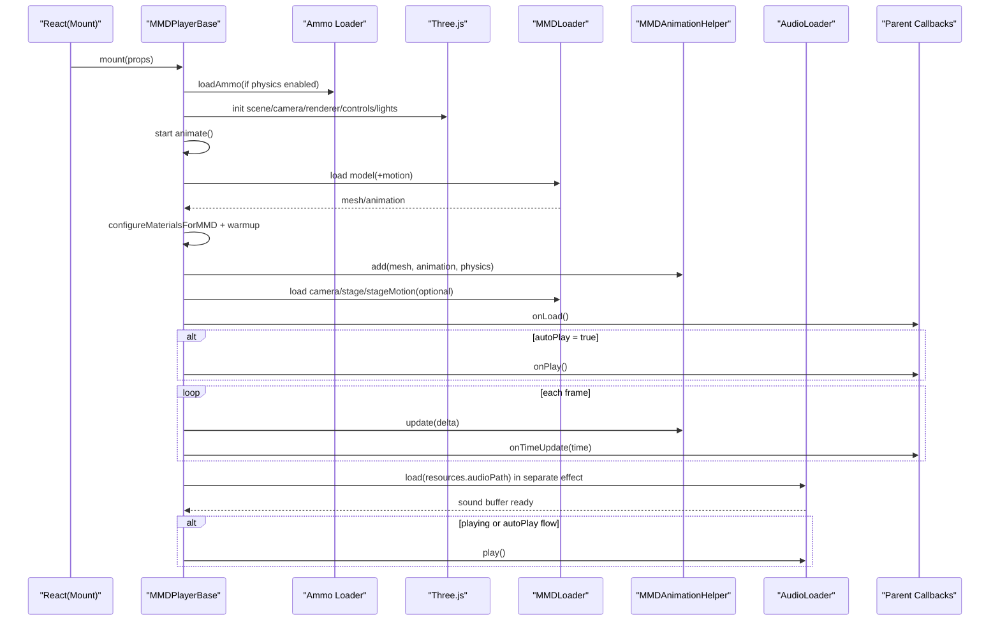
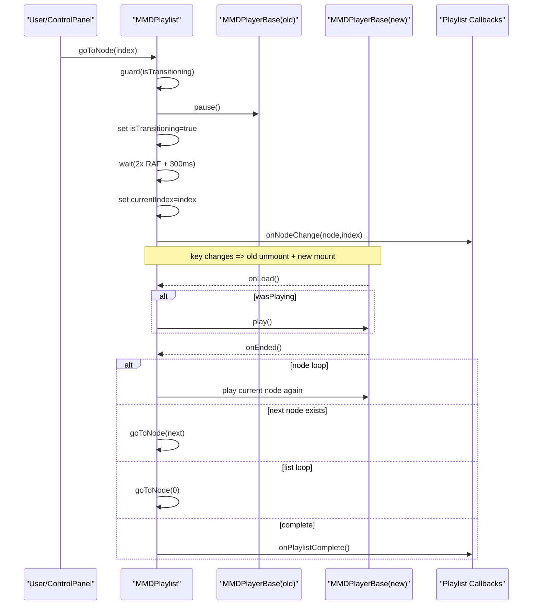
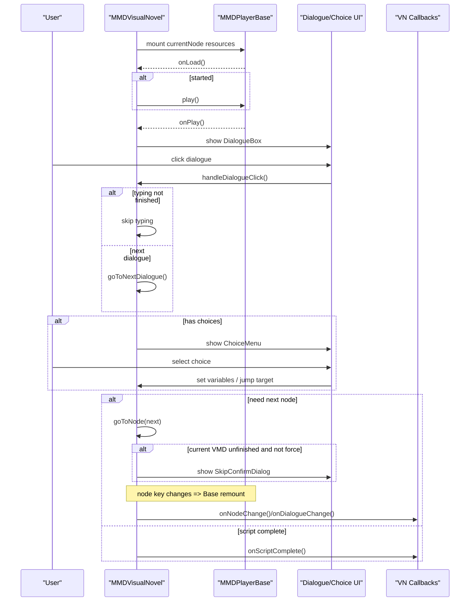
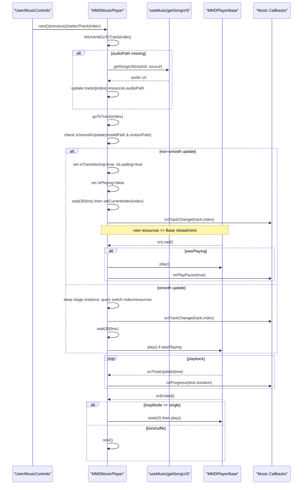

# MMD 模块组件运行流程（基于当前代码）

本文档基于 `src/mmd` 现状梳理，重点覆盖 Web 端可直接使用的组件运行链路。

## 1. 模块分层与入口

`src/mmd/index.ts` 暴露了 5 层能力：

1. 基础播放层：`MMDPlayerBase`
2. 业务封装层：`MMDPlayerEnhanced`、`MMDPlaylist`
3. 场景化层：`MMDMusicPlayer`、`MMDVisualNovel`、`MMDARPlayer`
4. 资产工具层：`pmx`（解析/编辑/导出）、`parsers`
5. 渲染与诊断层：`fx/*`、`utils/mmd-loader-config`、`utils/mmd-renderer-diagnostics`

## 2. 核心底座：MMDPlayerBase 运行流程

`MMDPlayerBase` 是所有 MMD 场景组件的实际渲染内核，生命周期如下：

### 2.1 初始化阶段（`useEffect` 主初始化）

1. 创建并重置初始化 ID（`initIdRef`），用于取消过时异步任务。
2. 根据 `stage.enablePhysics` 与 `mobileOptimization.disablePhysics` 决定是否加载 Ammo（`loadAmmo`）。
3. 若开启物理，Monkey Patch Ammo 构造器，追踪 `world/solver/cache/dispatcher/config` 实例，供卸载时销毁。
4. 构建 Three.js 基础对象：
`Scene`、`PerspectiveCamera`、`WebGLRenderer`、`OrbitControls`、光源、可选坐标轴。
5. 启动渲染循环 `animate()`（此时可渲染场景，但动画未必开始）。

### 2.2 资源加载阶段

1. 创建 `MMDLoader` + `MMDAnimationHelper`。
2. 模型加载：
有 `motionPath` 时走 `loadWithAnimation`，否则走 `load`。
3. 模型材质处理：
调用 `configureMaterialsForMMD`，并通过 `waitForMaterialsReady` 做纹理等待与一次预热渲染，避免“分批出现”。
4. 模型入场：
`scene.add(mesh)` + `helper.add(mesh, { animation, physics })`。
5. 可选加载：
`cameraPath`（相机动画）、`stageModelPath`（可数组多舞台）、`stageMotionPath`。
6. 舞台也会执行 morph 清理与材质预热，再加入场景。

### 2.3 播放阶段

1. 所有资源完成后置 `isReadyRef=true`，触发 `onLoad`。
2. 若 `autoPlay`，延迟 100ms 设 `isPlayingRef=true` 并触发 `onPlay`。
3. `animate` 每帧：
调用 `helper.update(delta)`，计算当前时间，触发 `onTimeUpdate`。
4. 非循环模式下，检测到超时长后触发 `onEnded` 并停止。

### 2.4 音频独立加载阶段（单独 `useEffect`）

音频与模型解耦：`resources.audioPath` 变化时不会触发整套场景重建。

1. 等待 `isAudioSystemReady`（`AudioListener` 与 `helper` 就绪）。
2. 用 `AudioLoader` 加载音频，绑定 `helper.add(sound, {duration})`。
3. 处理竞态：
如果加载完成时已在播放，立即 `sound.play()`；否则在 `autoPlay` 分支做延迟重试。

### 2.5 卸载与切换清理阶段

卸载时会执行重清理：

1. 停止 RAF、断开 ResizeObserver、停止音频。
2. 释放 `MMDAnimationHelper` 内对象、Mixer、Physics。
3. 按逆序销毁捕获的 Ammo 对象（`world -> solver -> cache -> dispatcher -> config`）。
4. 深度清理 Scene 几何体、材质、纹理、阴影贴图、Renderer 上下文。
5. 恢复 Ammo 原始构造函数，避免全局污染。

这也是上层组件通过 `key` 切换强制重挂载时能相对稳定的关键。

## 3. MMDPlayerEnhanced 运行流程

`MMDPlayerEnhanced` 是对 `MMDPlayerBase` 的“资源编排 + UI 控制”封装。

### 3.1 资源模式判定

1. `single`：直接使用 `resources`。
2. `list`：从 `resourcesList` 按 `currentId` 取资源。
3. `options`：按 `selection` 从 `resourceOptions` 组装 `MMDResources`。

### 3.2 切换机制

核心机制是给 `MMDPlayerBase` 传递变更 `key`：

1. `list` 模式 key=`currentId`
2. 其他模式 key=`JSON.stringify(currentResources)`

这会触发 `MMDPlayerBase` 完整卸载/重建，保障资源切换后状态干净。

### 3.3 UI 与控制链路

1. `ControlPanel`：播放/暂停、全屏、循环、坐标轴、设置面板入口。
2. `SettingsPanel`：列表选择或模型/动作/镜头/音频/舞台自由组合。
3. `showDebugInfo` 开启时挂 `MMDPlayerEnhancedDebugInfo`。

## 4. MMDPlaylist 运行流程

`MMDPlaylist` 负责“节点级编排”，底层仍是单实例 `MMDPlayerBase`。

### 4.1 节点切换（两阶段）

`goToNode(index)`：

1. 防重入：`isTransitioning` 为真时拒绝。
2. 暂停当前播放，进入过渡状态。
3. 双 RAF + `setTimeout(300ms)` 后切换 `currentIndex`。
4. 再双 RAF + `setTimeout(100ms)` 退出过渡，必要时恢复播放。

目的是给物理和 GPU 释放留出时间窗口。

### 4.2 播放结束策略

1. 若单节点循环 `isLooping=true`，重播当前节点。
2. 否则切下个节点；若到末尾且列表循环开启则回到 0。
3. 不循环且结束时触发 `onPlaylistComplete`。

### 4.3 预加载说明

当前 `preload`（`none/next/all`）只做“预加载标记与日志”，并未创建隐藏播放器进行真实资源预取。

## 5. MMDMusicPlayer 运行流程

`MMDMusicPlayer` = `MMDPlayerBase` + 音乐列表业务状态机。

1. 维护 `tracks/currentIndex/loopMode/currentTime/duration`。
2. Miku 模式下可通过 `useMusic()` 搜索与补全 `audioPath`。
3. 切歌 `goToTrack`：
判断是否为“平滑切换”（同模型同动作）；
非平滑切换走过渡遮罩与延迟切换；
平滑切换尽量保持舞台并快速恢复播放。
4. `onTimeUpdate` 驱动进度；`onEnded` 根据 `loopMode` 选择单曲循环/下一曲。
5. 暴露 ref：`play/pause/next/previous/goToTrack/setLoopMode/getState`。

## 6. MMDVisualNovel 运行流程

`MMDVisualNovel` 将 MMD 场景与对话系统绑定为剧情状态机。

### 6.1 主状态

`currentNodeIndex/currentDialogueIndex/isTyping/isAutoMode/history/variables/showChoices/showLoopConfirm`。

### 6.2 节点迁移

1. `goToNode` 支持 `force`。
2. 若当前有 VMD 且未播完，非强制跳转会先弹 `SkipConfirmDialog`。
3. 切换时与 Playlist 类似：先进入过渡，再延迟更新节点索引与首条对话。

### 6.3 对话推进

1. 打字效果完成后，根据 `isAutoMode` 或 `waitForClick=false` 自动推进。
2. 有分支时展示 `ChoiceMenu`。
3. 分支可写入变量（`setVariable`）并跳转节点/对话。
4. 末节点在 `loop=true` 下弹 `LoopConfirmDialog`，可重开或回开始页。

### 6.4 与播放器同步

1. `MMDPlayerBase onLoad` 控制加载遮罩。
2. `onPlay` 作为“动画已开始”信号，决定是否显示对话框。
3. `onTimeUpdate/onEnded` 判定 VMD 完成状态，决定是否允许无确认跳转。

## 7. MMDARPlayer 运行流程

当前 `MMDARPlayer` 为 AR.js + Three.js 的独立 AR 播放器实现，未复用 `MMDPlayerBase`。

1. 初始化阶段：
`initializeThreeJS` -> `initializeAR` -> 摄像头权限 -> ARToolkit Source/Context -> Marker Controls。
2. 渲染阶段：
RAF 循环中更新 `arToolkitContext`，同步 `markerDetected` 状态并渲染。
3. 交互阶段：
`placeModel` 将选中模型放置到 marker 位置；
`takePhoto` 合成渲染画面并下载。
4. 卸载阶段：
`renderer.dispose()`，停止媒体轨，移除陀螺仪监听。

## 8. PMX/Parsers 组件流程

### 8.1 PMXViewer（`pmx/components` 与 `parsers/components`）

1. `useEffect` 监听 `modelUrl`。
2. `PMXParser.loadAndParse(modelUrl)` 拉取并解析。
3. 解析结果落入 `result`，UI 分 tab 展示：概览/纹理/材质/映射。

### 8.2 PMXEditor

1. 初始化时解析 PMX 并构建 `PMXEditorCore`。
2. 编辑操作（材质贴图绑定、增删纹理）直接改内存数据并记录 history。
3. 导出走 `PMXExporter.exportAndDownload`。

注意：当前导出器写入的是“顶点/面占位符”，不保留完整几何数据，适合配置级编辑，不适合生产级完整 PMX 重建。

## 9. FX 组件链路（渲染增强）

`FXParser` -> `FXToThreeAdapter` -> `MultiFXAdapter` 是 FX 解析与映射主链。

1. `FXParser` 解析 `.fx/.x`，可选 HLSL->GLSL 转换。
2. `FXToThreeAdapter` 提取材质/渲染配置，或生成 ShaderMaterial。
3. `MultiFXAdapter` 负责多文件按优先级与策略（override/merge/additive）合并。

在 `MMDPlayerBase` 中已预留 FX 相关 ref 与流程，但当前对舞台材质应用 FX 的具体逻辑多为注释/预留代码，属于可扩展状态。

## 10. 组件选型建议

1. 单场景播放：优先 `MMDPlayerEnhanced`
2. 多节点串联：`MMDPlaylist`
3. 音乐播放器产品态：`MMDMusicPlayer`
4. 剧情/Galgame：`MMDVisualNovel`
5. AR 交互：`MMDARPlayer`
6. 资源检查与编辑：`PMXViewer` / `PMXEditor`

## 11. 当前实现的关键事实（便于避免误解）

1. `MMDPlaylist` 目前没有真实后台预加载，仅有预加载标记策略。
2. `MMDPlayerBase.seek()` 仍是未完整实现状态（有告警）。
3. `MMDARPlayer` 当前是简化 AR 3D 模型流程，不是完整 MMD 角色播放栈。
4. PMX 导出是“结构信息优先”，不是完整 PMX 重建器。

## 12. 调用时序图（Mermaid）

### 12.1 MMDPlayerBase 初始化与播放时序

### 12.2 MMDPlaylist 节点切换时序

### 12.3 MMDVisualNovel 对话推进与节点迁移时序

### 12.4 MMDMusicPlayer 切歌与平滑切换时序

